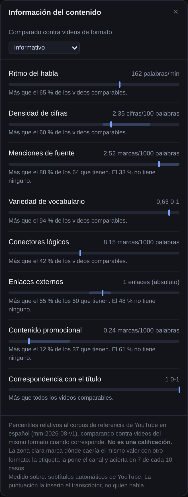
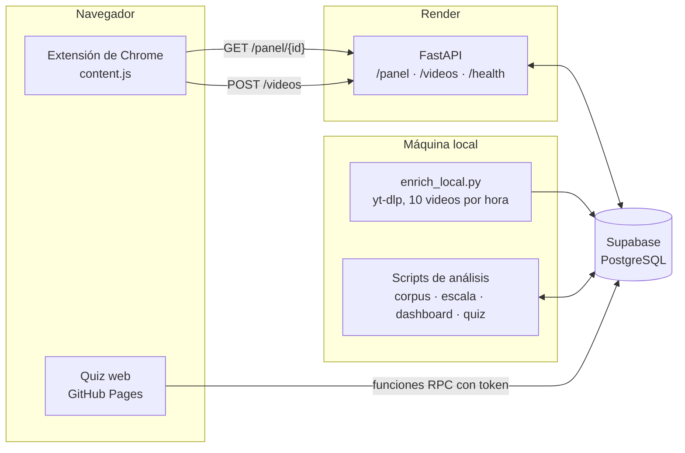

# Cognitive Analysis

**Información del contenido para videos de YouTube.** Una extensión de Chrome que, al abrir un video, muestra su composición medible (ritmo del habla, densidad de cifras, menciones de fuente, variedad de vocabulario, contenido promocional…) comparada contra un corpus de referencia de YouTube en español.

Funciona como la tabla nutricional de un envase: no te dice si el producto es bueno, te dice qué tiene. Decidir sigue siendo cosa tuya.



## El problema

Consumimos horas de video sin ningún dato sobre qué hay adentro antes de invertir el tiempo. Las métricas visibles (vistas, likes, comentarios) describen al canal y al algoritmo, no al contenido.

El panel aparece junto al video, justo cuando se decide si mirarlo o no, sin abrir otra aplicación ni pegar ninguna URL.

## El giro: por qué no hay nota

El proyecto empezó como **«Nutri-Score de Contenidos»**: un score de 0 a 100 y una letra de la A a la E. Antes de construir encima, lo medí contra mis propios datos:

- De 96 videos puntuados, **ninguno salió A, D ni E**. Todo era B o C, con un desvío de unos 3 puntos sobre 100.
- El score tenía una **correlación de 0,73 con el logaritmo de la duración**. La mitad de la varianza del «valor cognitivo» era, literalmente, cuánto duraba el video.

Era un cronómetro disfrazado. Y aunque no lo hubiera sido, una letra calculada sobre medidas ponderadas a mano transmite una autoridad que el sistema no tiene.

Así que se eliminaron la letra, la agregación y el nombre. «Nutri-Score» es el sello frontal A–E, justo la pieza que el proyecto sacó; lo que sobrevivió de la analogía es la **tabla nutricional**. Cada descriptor que quedó tuvo que pasar la prueba que el score original no pasaba: no ser la duración con otro nombre.

## Qué muestra el panel

Ocho descriptores calculados sobre la transcripción y la descripción del video, normalizados por minuto o por cada 100 o 1.000 palabras (el «por 100 g» del envase):

| En el panel | Qué cuenta |
|---|---|
| Ritmo del habla | palabras por minuto |
| Densidad de cifras | números, en dígitos o en palabras, por cada 100 palabras |
| Menciones de fuente | «según», «un estudio», «el informe»… por cada 1.000 palabras |
| Variedad de vocabulario | MATTR con ventana de 200 palabras (0–1), que no cae con la longitud como el TTR clásico |
| Conectores lógicos | «porque», «sin embargo», «por lo tanto»… por cada 1.000 palabras |
| Enlaces externos | URLs en la descripción, sin contar las redes del propio canal (valor absoluto) |
| Contenido promocional | llamadas a la acción y menciones de patrocinio por cada 1.000 palabras |
| Correspondencia con el título | qué fracción de las palabras clave del título aparece en la transcripción |

Ninguno mide calidad: un video con cifras inventadas puntúa igual que uno con cifras verdaderas. Es una limitación declarada, no un bug. El detalle de cada cálculo está en el [glosario](docs/glosario_descriptores.md).

Cada valor se ubica como **percentil** contra el corpus de referencia, con cuatro reglas de diseño que no se negocian:

- **Sin letra, sin nota agregada y sin semáforo.** Todas las barras tienen el mismo color; lo único que informa es la posición del marcador. La etiqueta de un alimento tampoco pinta de rojo las calorías.
- **El percentil describe; el adjetivo juzga.** El panel dice «más que el 65 % de los videos comparables», nunca «alto» ni «bueno».
- **Si no se puede medir, lo dice.** Un video con poca habla (música, gameplay, tomas sin voz) recibe «sin datos suficientes», nunca un cero.
- **Lo incierto se declara.** El formato contra el que se compara es corregible y su margen se dibuja como una banda; el pie del panel dice de dónde salió la transcripción.

## Cómo se validó

**Un corpus de referencia en vez de mi historial.** Los primeros cortes salían de mi propio historial: 94 videos, con el 41 % de los minutos en un solo canal. Era como una etiqueta que dice «alto en proteínas» comparando contra lo que hay en tu heladera. Se reemplazó por una muestra estratificada de YouTube en español (Argentina y España):

- 4 macroformatos × 3 duraciones = 12 celdas de 33 videos: **396 videos de 396 canales distintos** (índice de concentración HHI de 0,0025, contra 0,216 del historial).
- Dos fuentes con sesgos opuestos: canales de los rankings de YouTube y 70 términos de búsqueda neutros con ventanas temporales al azar, ordenados por fecha y no por relevancia.
- Semilla fija: el sorteo se reprodujo de forma independiente y devolvió los mismos 396 videos.
- **344 videos aptos** para el panel, con habla suficiente para medir.

**La duración no volvió.** Sobre el corpus, la correlación media dentro de cada celda entre cualquier descriptor y la duración es como mucho 0,13, contra el 0,73 del score original. La correlación máxima entre dos descriptores es 0,26: son ocho números, no ocho copias del mismo. Varios candidatos cayeron por esta misma prueba: la proporción de palabras que aparecen una sola vez correlacionaba −0,82 con la duración, y los enlaces divididos por minuto, −0,68 (en valor absoluto baja a −0,05, por eso quedó así).

**La estructura de la escala la decide una prueba, no yo.** Para cada descriptor, una prueba de permutación (2.000 remezclas) decide si hace falta escala por formato o alcanza con la global: 5 de los 8 la necesitan. Los que valen cero en más de un tercio del corpus (fuentes, enlaces y promocional) no se presentan en terciles, porque el tercil deja de existir, sino como presencia más magnitud: «el 48 % no tiene ninguno; entre los que tienen, más que el 55 %».

En el camino apareció un bug en la propia prueba: permutar sobre el percentil 33 de una variable con masa en cero da p = 1,0 sin haber medido nada, y habría dejado esos tres descriptores como globales. Se corrigió usando la tasa de presencia como estadístico.

**La etiqueta de formato es del canal, no del video.** Sale de la categoría que el canal se autoasigna en YouTube. Contrastada con un clasificador que lee el contenido, coincide en 7 de cada 10 casos (kappa de Cohen 0,54). Por eso el panel no la afirma: la declara, deja corregirla y dibuja el margen.

**El hallazgo que no esperaba:** además de puntuar distinto en algunos descriptores, los formatos difieren en algo más básico, que es si se pueden medir. Los videos sin habla suficiente van del 3 % en el formato informativo al 19 % en entretenimiento. La frontera que más pesa no pasa entre informar y entretener, sino entre tener habla y no tenerla.

## Las otras dos piezas

**Dieta cognitiva.** Un dashboard HTML que agrega el historial propio contra la misma escala, con filtros de fecha, formato y denominador. Pasar de contar *videos* a contar *minutos* da vuelta lecturas: en mi historial, la variedad de vocabulario cae del percentil 76 al 43, porque un podcast de dos horas pesa lo que ocupó y no como un video más. Tiene dos protecciones: con menos de 15 videos una fila muestra puntos sueltos en vez de una mediana, y si un canal se lleva más del 40 % del recorte, el dashboard lo nombra.

**Quiz de retención.** Es la variable objetivo. Después de ver un video, el participante responde preguntas generadas desde la transcripción, desde un enlace personal y sin instalar nada. Un LLM genera las preguntas y tres filtros automáticos las depuran: la cita tiene que existir en la transcripción, tiene que respaldar la respuesta, y la opción correcta no puede delatarse por su forma. Un segundo modelo, de otro proveedor, contesta **sin ver el video**; su acierto marca el piso de lo adivinable y se descuenta de la retención humana. La IA generativa se usa solo acá, nunca para valorar el contenido: eso volvería circular todo el sistema.

La pregunta que le da sentido al proyecto es **si los ocho descriptores predicen la retención mejor que un cronómetro**. El análisis quedó fijado antes de tener datos: GLM binomial, validación cruzada agrupada por video, log(duración) como baseline a batir y un criterio de aceptación de mejorar el error absoluto medio al menos un 10 % con un bootstrap que no cruce el cero. Está en la [entrega 4](docs/entregas/04_analisis_modelado.md).

## Estado y limitaciones

A septiembre de 2026:

- **Funciona:** la extensión, el backend desplegado, el corpus y la escala, el dashboard y el quiz web con enlace personal.
- **La variable objetivo casi no tiene datos.** Respondieron el quiz 3 personas, yo incluido, y el objetivo es llegar a 10–20. Hasta entonces la pregunta central sigue abierta y no hay ningún resultado predictivo que reportar.
- **No hubo evaluadores humanos independientes** para validar los descriptores. Fue una decisión de alcance, y está declarada.
- **Los descriptores cuentan, no verifican.** Detectan que se nombra una fuente, no que sea confiable.
- **El corpus cubre solo español de Argentina y España**, y su dimensión temporal está muestreada por conglomerados (55 ventanas de 30 días), así que no sirve para afirmar tendencias en el tiempo.
- **Arranque en frío:** el backend corre en el plan gratuito de Render y la primera consulta del día puede tardar.
- **Diseñado pero no implementado:** elegir contra quién compararse (incluido «lo que yo suelo mirar») y los accesos directos del panel al quiz y a la dieta.

---

## Arquitectura



- **Un solo cuerpo de reglas.** `backend/scripts/nutriscore_features.py` es el módulo con el que se construyó la escala, el que usa `/panel` y el que alimenta el dashboard. La extensión y el dashboard solo dibujan: no hay lógica de medición en JavaScript, así que lo que mide el estudio y lo que muestra el producto no pueden separarse.
- **`/panel` solo lee.** Devuelve el panel, «procesando» si el video todavía no tiene transcripción, o «sin datos suficientes». Lo único que consume créditos de Supadata es el enriquecimiento en segundo plano que dispara `POST /videos` para un video nuevo.
- **La ingesta masiva corre en local, no en la nube,** porque YouTube bloquea las IP de datacenter. `enrich_local.py` usa `content_items` como cola (estado, intentos y reintentos espaciados) y el Programador de tareas de Windows lo lanza una vez por hora: 10 pedidos por hora no despiertan al antibot.
- **Traer una vez, iterar mil.** Las transcripciones se guardan con sus segmentos y capítulos, así que los descriptores se recalculan sin volver a pedir nada.
- **El quiz no expone datos.** Las tablas tienen RLS sin políticas (deny por defecto); el rol anónimo solo puede ejecutar funciones `security definer`, y la respuesta correcta no llega al navegador hasta que el participante contesta.

## Mapa del repositorio

```
├── cognitive-analysis-ext/     Extensión de Chrome (Manifest V3)
│   └── content.js              Panel en Shadow DOM, registro de visionado, keep-alive
├── backend/
│   ├── app/                    API FastAPI, desplegada en Render
│   │   ├── main.py             App, CORS, /health
│   │   ├── routes/panel.py     GET /panel/{video_id}: descriptores y percentiles
│   │   ├── routes/videop.py    POST /videos: registro y enriquecimiento en segundo plano
│   │   ├── routes/admin.py    /admin/*: lo que el sitio no puede hacer solo (con clave)
│   │   └── escala_referencia.json
│   ├── scripts/                Ingesta, análisis y quiz (corren en local)
│   ├── migrations/             SQL de Supabase, 001 a 013
│   └── tests/                  Pruebas del panel, sin red ni base de datos
├── docs/                       El sitio publicado en GitHub Pages
│   ├── index.html              Portada
│   ├── dieta.html              Dashboard en vivo (pide los datos al backend)
│   ├── quiz.html               Quiz de retención por token
│   ├── generar.html            Generación de quizzes (con clave)
│   ├── sitio/                  CSS y JS comunes a las cuatro páginas
│   ├── entregas/               Entregas del máster, en orden
│   ├── assets/                 Imágenes, generadas desde assets/fuentes/
│   ├── quiz_piloto/            Piloto e informes de generación de preguntas
│   └── *.md, *.csv             Informes y datos de validación
├── privado/                    Foto del dashboard con datos (ignorada por git)
├── guias/                      Enunciados de las entregas
├── render.yaml                 Despliegue del backend
└── requirements.txt            Dependencias del backend
```

## El sitio

Todo vive en <https://joteiro.github.io/Cognitive-Analysis/>, servido por GitHub Pages desde `docs/`:

| Página | Qué es | Quién entra |
|---|---|---|
| `index.html` | Portada | cualquiera |
| `dieta.html` | El dashboard del historial, **en vivo**: pide las filas a `/admin/dieta` cada vez que se abre | con clave |
| `quiz.html` | El quiz de retención; se entra con el enlace personal (`?t=<token>`) | participantes |
| `generar.html` | Generar preguntas para un video del historial y sumarlo a la cola propia | con clave |

Pages es estático: no puede guardar secretos ni leer la base. La mitad de servidor es
`backend/app/routes/admin.py`, en el mismo Render que el panel, y **no reimplementa nada**:
importa `build_dashboard` para las filas, `generar_quiz` para los filtros y la línea de base, y
`cargar_quiz` para guardar. Si cambia el criterio en un script, cambia en la web.

La clave viaja en la cabecera `X-Clave-Admin` y se compara con la variable `ADMIN_KEY` del
servidor. **Sin `ADMIN_KEY` —o con menos de 16 caracteres— el modo admin queda apagado**, nunca
abierto. La clave se guarda solo en el navegador que la escribió.

Variables de entorno del backend, además de `DATABASE_URL`:

| Variable | Para qué | Por defecto |
|---|---|---|
| `ADMIN_KEY` | Habilita `/admin/*`. Sin ella, 503 | — (apagado) |
| `GEMINI_API_KEY` | Generar preguntas | — |
| `QUIZ_MODELO_CONTROL` | Modelo de la línea de base, que **no puede ser el mismo** que genera | `gemini-2.5-flash-lite` |
| `QUIZ_PROVEEDOR` / `QUIZ_PROVEEDOR_CONTROL` | Cambiar a Groq si vuelve a estar disponible | `gemini` |
| `PERSONA_PROPIA` | Seudónimo dueño del historial | `juan-01` |

Dos detalles que son de medición, no de interfaz:

- Cuando un video del historial entra en la cola, el visionado se registra con
  `content_items.watched_at` —cuándo lo vi de verdad— y de ahí salen los días hasta la
  respuesta. Por eso el quiz **no vuelve a mostrar el video** si ya está visto: mostrarlo otra
  vez convertiría la retención en lectura.
- La página de generación **no muestra las preguntas**, solo cuántas sobrevivieron y por qué
  cayeron las otras. Quien genera es quien después contesta.

La foto del dashboard (`build_dashboard.py` sin argumentos) va a `privado/`, que git ignora:
todo lo que está en `docs/` lo publica GitHub Pages, y esa foto es el historial con títulos,
canales y fechas.

## Arranque rápido

### Probar la extensión

La extensión apunta al backend desplegado, así que no hace falta levantar nada:

1. Abrir `chrome://extensions`, activar el **modo de desarrollador** y elegir **Cargar descomprimida** → carpeta `cognitive-analysis-ext/`.
2. Abrir cualquier video de YouTube. El panel aparece abajo a la derecha a los pocos segundos.

Si el video no estaba en la base, el panel muestra «Analizando…» mientras el backend lo enriquece. Por el arranque en frío, la primera consulta del día puede tardar un par de minutos.

### Levantar el backend en local

Con Python 3.11:

```bash
python -m venv .venv
.venv\Scripts\activate          # macOS/Linux: source .venv/bin/activate
pip install -r requirements.txt
```

Crear `backend/.env`:

```
DATABASE_URL=postgresql://postgres.<ref-del-proyecto>:<clave>@<host-del-pooler>:<puerto>/postgres
YOUTUBE_API_KEY=...
SUPADATA_API_KEY=...
```

Y arrancar:

```bash
cd backend
uvicorn app.main:app --reload
```

Para que la extensión use el backend local, cambiar `API_BASE` en `cognitive-analysis-ext/content.js` por `http://localhost:8000` (el permiso ya está en el manifiesto) y recargar la extensión.

Tres tropiezos que ya costaron horas:

- Con el pooler de Supabase, el usuario es `postgres.<ref-del-proyecto>`, no `postgres`. El error dice «password authentication failed» y manda a buscar donde no es. `python backend/scripts/probar_dsn.py` valida la cadena en segundos sin imprimir la contraseña.
- Si la contraseña tiene `@`, `:`, `/` o `?`, hay que codificarla antes de ponerla en la URL.
- `/panel` necesita pandas y numpy: hay que correr uvicorn con el Python del entorno virtual, no con el del sistema.

### Base de datos

Las migraciones de `backend/migrations/` se aplican en orden de nombre desde el editor SQL de Supabase. Crean el esquema base, la cola de enriquecimiento, las columnas del corpus de referencia, la tabla del panel persistente y las tablas y funciones del quiz.

### Variables de entorno

| Variable | La usan |
|---|---|
| `DATABASE_URL` | el backend y todos los scripts |
| `YOUTUBE_API_KEY` | el backend (metadatos) y `build_reference_corpus.py` |
| `SUPADATA_API_KEY` | el backend (transcripción de videos nuevos) |
| `GEMINI_API_KEY`, `GROQ_API_KEY` | `generar_quiz.py` (generador y línea de base) |
| `SUPABASE_URL`, `SUPABASE_ANON_KEY` | `armar_quiz_web.py` |
| `PRECALENTAR_PANEL` | opcional: con `1` precarga pandas al arrancar. Apagado por defecto porque la instancia gratuita tiene 512 MB |
| `DEBUG_DB` | opcional: muestra el host de la conexión, nunca la contraseña |

### Pruebas

Corren desde la raíz, sin red y sin base de datos:

```bash
python backend/tests/test_panel_alternativas.py
npm install jsdom && node backend/tests/test_content_panel.mjs
```

`test_panel_alternativas.py` importa el `panel.py` real con la base simulada. `test_content_panel.mjs` ejecuta `content.js` entero contra una respuesta **generada por el backend real**: si la extensión y el backend se desalinean, la prueba falla. Más detalle en [`backend/tests/LEEME.md`](backend/tests/LEEME.md).

### Pipeline de datos

Los scripts de `backend/scripts/` corren en local, más o menos en este orden:

| Paso | Script | Qué hace |
|---|---|---|
| Ingesta | `enrich_local.py` | Transcripción y metadatos con yt-dlp. En modo worker (`--max 10`) lo lanza `run_enrich.bat` cada hora |
| Corpus | `build_reference_corpus.py` | Muestrea el corpus de referencia: `--dry-run` primero, después `--commit --cache` para insertar exactamente lo revisado |
| Escala | `build_reference_scale.py` | Calcula la escala y escribe `escala_referencia.json` y `validacion_escala.md` |
| Panel | `backfill_panel.py` | Calcula el panel de los videos que entraron sin pasar por la extensión |
| Dashboard | `build_dashboard.py` | Escribe la **foto** con datos en `privado/` (fuera de `docs/`, que es público). El dashboard del sitio es en vivo y no hay que regenerarlo; `--vivo` se corre solo si cambió la plantilla |
| Preguntas | `generar_quiz.py` → `cargar_quiz.py --etiqueta <etiqueta>` | Genera y filtra preguntas para los videos que todavía no tienen quiz, y las sube a Supabase |
| Quiz web | `armar_quiz_web.py` | Arma la página del quiz para participantes externos. Sus respuestas llegan solas a Supabase |
| Quiz propio | `armar_quiz_html.py --persona <id>` → `cargar_quiz.py --todas` | Arma un formulario HTML con los videos que le faltan a esa persona. Las respuestas bajan como JSON y **hay que cargarlas a mano** (ver abajo) |
| Control | `verificar_formato.py` | Contrasta la etiqueta de formato con un clasificador y calcula kappa |

Las dependencias de análisis están en `backend/scripts/requirements-analisis.txt`; el worker necesita además `yt-dlp` y `youtube-transcript-api`.

#### Cargar las respuestas del quiz HTML

El formulario de `armar_quiz_html.py` funciona sin conexión, así que no escribe en la base. El orden importa:

1. Contestar el `.html` de `docs/quiz_piloto/formularios/`. Al terminar se descarga `respuestas_<persona>_<fecha>.json`.
2. Mover ese archivo a `docs/quiz_piloto/respuestas/`.
3. Cargarlo desde `backend/scripts`:

   ```bash
   .venv\Scripts\python cargar_quiz.py --dry-run --todas   # revisa sin escribir
   .venv\Scripts\python cargar_quiz.py --todas
   ```

   `--todas` sube todos los archivos de la carpeta y es idempotente: volver a cargar no duplica.
4. Recién después, armar la tanda siguiente con `armar_quiz_html.py`. Si la armás antes de cargar, te vuelve a dar los mismos videos.

Una trampa de `generar_quiz.py`: correr `--saltar-existentes` sobre una etiqueta que ya existe, sin `--reanudar`, reescribe el archivo solo con los videos nuevos. Conviene usar una etiqueta nueva en cada corrida.

## Documentación

| Documento | Contenido |
|---|---|
| [Glosario de descriptores](docs/glosario_descriptores.md) | Qué mide cada descriptor, cómo se calcula y qué no mide |
| [Validación de la escala](docs/validacion_escala.md) | Prueba de permutación, chequeo de duración y redundancia |
| [Marco muestral](docs/marco_muestral_corpus_referencia.md) | Diseño del corpus de referencia y sus limitaciones |
| [Métricas y etiquetas v2](docs/metricas_y_etiquetas_v2.md) | Cómo se eligió el panel y qué se descartó, con evidencia |
| [Verificación del formato](docs/formato_verificado.md) | Etiqueta de formato contra clasificador |
| [Informe del historial](docs/informe_historial.md) | Mi historial medido contra la escala |
| [Protocolo de reclutamiento](docs/protocolo_reclutamiento.md) | Cómo se mide la retención con participantes externos |
| [Entregas](docs/entregas/) | Las entregas del máster en orden. Las primeras conservan el nombre original a propósito, como registro de la etapa |

## Autor

Juan Taraciuk. Proyecto final del Máster en Data Science & IA de Evolve Academy (Madrid), 2026.
