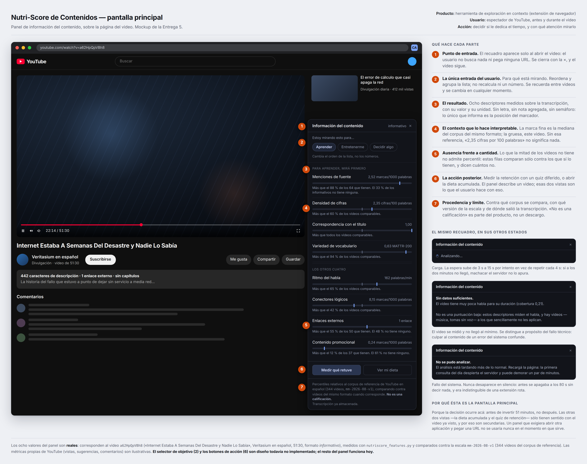
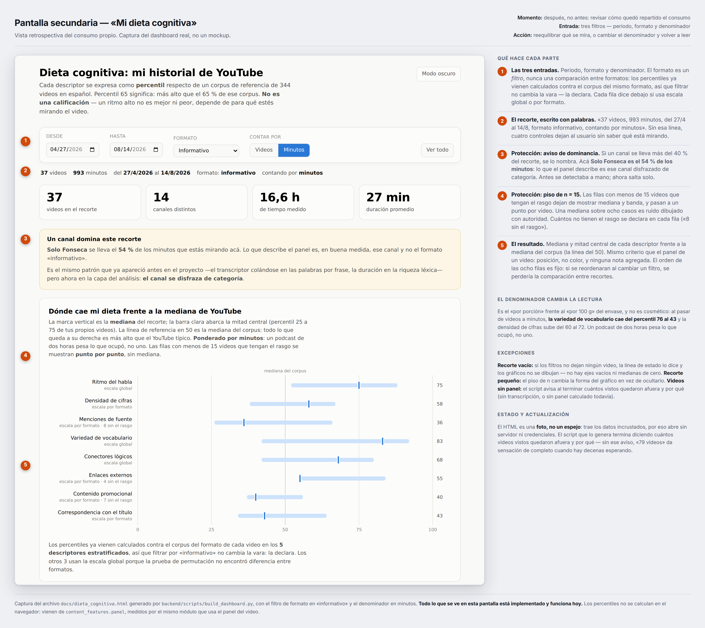
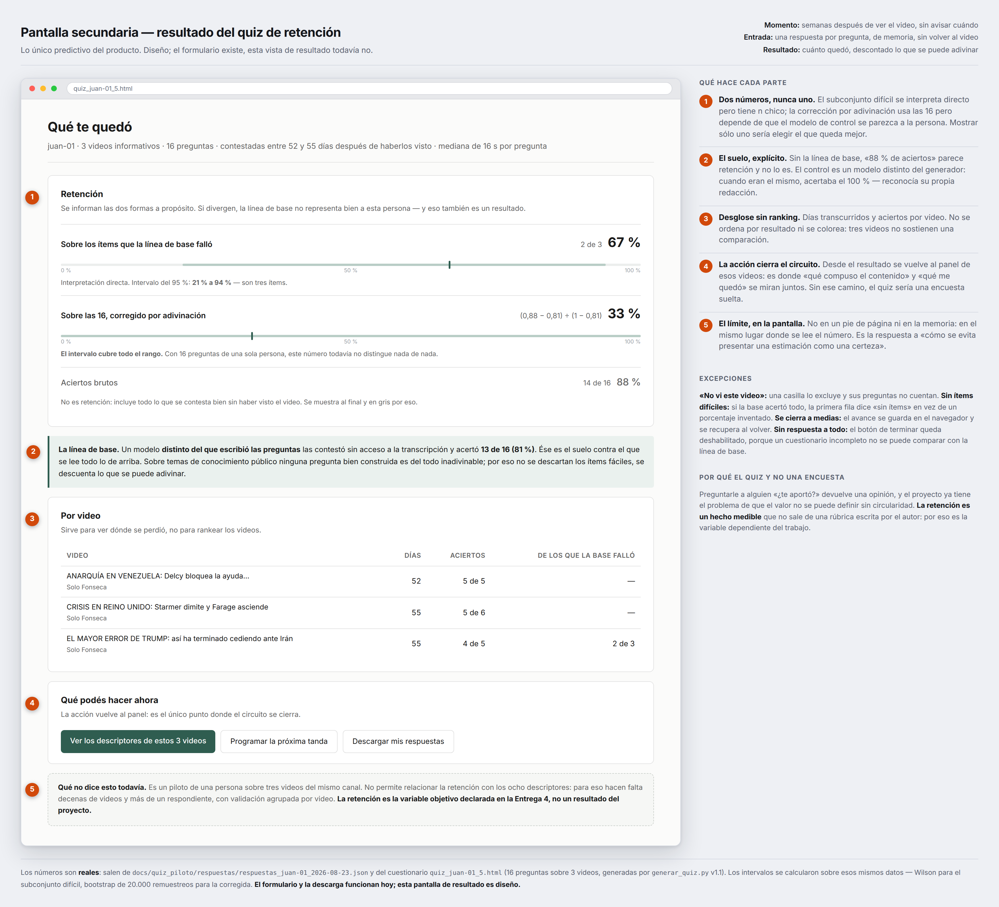

# Entrega 5 — Diseño del frontal y experiencia de usuario

**Proyecto:** Nutri-Score de Contenidos (repositorio `Cognitive Analysis`)
**Autor:** Juan Taraciuk
**Fecha:** agosto de 2026

> **Nota de incrementalidad.** Esta entrega no sustituye ninguna anterior. Documenta el
> frontal del producto que las Entregas 2 a 4 fueron construyendo por debajo, e introduce
> tres elementos de diseño que no existían antes: un **selector de objetivo del usuario**
> (§3.2), una **vista de resultado del quiz** (§4) y dos **acciones posteriores** desde el
> panel (§3.2). Los tres están señalados como no implementados en §5. Además corrige una
> línea de texto del panel actual, declarada en §5.3.

---

## 1. Resumen de la solución y del usuario

### 1.1. Qué problema resuelve el proyecto

Un envase de comida declara proteínas, azúcares y calorías. Un video de YouTube declara
duración, vistas y «me gusta» — tres cifras que describen la **popularidad del canal**, no
la **composición del contenido**. Quien va a invertir cincuenta minutos no tiene ninguna
información sobre qué está por consumir hasta que ya lo consumió.

El proyecto responde con un **panel de ocho descriptores verificables** medidos sobre la
transcripción y expresados como percentiles respecto de un corpus público de referencia de
344 videos en español, muestreado por estratos. No es un juicio de calidad: es la etiqueta
nutricional del contenido.

### 1.2. Quién es el usuario principal

El **espectador**, en el momento en que abre un video. No un analista, no un investigador,
no el creador del contenido. Esta distinción condiciona todo el diseño: alguien que está a
punto de mirar un video no va a abrir otra aplicación, buscar el video otra vez y pegar una
URL. Si la información no aparece donde ya está mirando, no se usa.

Hay un usuario secundario, que es **la misma persona una semana después**: el que quiere
saber cómo quedó repartido su consumo, y el que contesta el quiz de retención.

### 1.3. Qué decisión concreta tiene ese usuario

| Momento | Decisión | Qué necesita saber |
|---|---|---|
| Antes de empezar | Si le dedica el tiempo, y con qué atención | Con qué está hecho este video: si trae cifras y fuentes, o si es un monólogo de ritmo alto sin nada verificable |
| Durante | Si sigue o abandona | Si lo que prometía el título se corresponde con lo que se está diciendo |
| Después (retrospectivo) | Cómo reequilibra su dieta de consumo | Cuánto de lo que miró tenía cada rasgo, y en qué proporción de su tiempo real |
| Semanas después | Si el tiempo invertido rindió | Cuánto retuvo, descontado lo que se puede adivinar sin haber visto nada |

### 1.4. Qué tipo de producto es

Una **herramienta de exploración en contexto**: un panel informativo que se superpone a la
página del video, más dos vistas de apoyo (un dashboard retrospectivo y un cuestionario
diferido con su resultado).

No es un recomendador y no es un clasificador, y las dos ausencias son deliberadas. Un
recomendador decidiría por el usuario qué mirar; un clasificador emitiría una etiqueta de
calidad. La revisión de la Entrega 2 señaló que el riesgo central del proyecto es **definir
«valor cognitivo» de forma circular**: si la etiqueta sale de una rúbrica escrita por el
propio autor o de la opinión de un modelo de lenguaje, el sistema se limita a confirmar sus
propias premisas. La letra A–E del prototipo original se eliminó por eso. El frontal está
construido sobre esa restricción, no a pesar de ella.

### 1.5. Resultado y acción principal

**Resultado:** ocho medidas del video abierto, cada una con su valor, su unidad y su
posición frente a videos comparables.

**Acción:** el usuario decide, con su propio criterio, si ese perfil le sirve para lo que
vino a hacer. El frontal no toma la decisión — la hace posible. Es exactamente lo que hace
una etiqueta nutricional: no dice «no comas esto», pero quien busca proteína mira proteína
y resuelve en dos segundos.

---

## 2. Imagen mockup del frontal

### 2.1. Pantalla principal



Los ocho valores del panel son reales: corresponden al video `a62HpQpVBh8` («Internet
Estaba A Semanas Del Desastre y Nadie Lo Sabía», Veritasium en español, 51:30, formato
*informativo*), medidos con `nutriscore_features.py` y comparados contra la escala
`mm-2026-08-v1`. Las métricas propias de YouTube que aparecen alrededor (vistas,
sugerencias, comentarios) son ilustrativas.

### 2.2. Pantallas secundarias

**Mi dieta cognitiva** — la vista retrospectiva. Es una captura del dashboard real, no un
mockup: el archivo existe y funciona.



**Resultado del quiz de retención** — la única parte predictiva del producto. El formulario
y la descarga de respuestas funcionan hoy; esta vista de resultado es diseño.



### 2.3. Por qué la principal es la del panel

Porque es donde ocurre la decisión: **antes de invertir cincuenta minutos, no después**. Las
otras dos vistas sólo tienen sentido con el video ya visto. Un frontal que exigiera abrir
otra aplicación y pegar una URL sería más fácil de construir y no se usaría nunca en el
único momento en que sirve.

---

## 3. Justificación del diseño

### 3.1. Utilidad y valor de la solución

#### Qué tarea permite resolver

Convierte una decisión que hoy se toma a ciegas —o peor, guiada por el título y la
miniatura, que son piezas de marketing— en una decisión informada por ocho medidas
verificables del contenido real.

#### Qué mejora concretamente

- **Ahorra tiempo mal invertido.** Cincuenta minutos de video son cincuenta minutos. La
  decisión de no empezar es tan valiosa como la de empezar, y hoy no hay ninguna
  información para tomarla.
- **Reduce un riesgo específico: confundir duración con sustancia.** El primer scorer del
  proyecto tenía una correlación de **0,73 con el logaritmo de la duración**: la mitad de
  su varianza era un cronómetro disfrazado de calidad. Los ocho descriptores actuales se
  construyeron para no serlo (ninguno supera un |r| de 0,35 con log(duración)). El frontal
  muestra justamente lo que la duración no dice.
- **Hace visible la correspondencia entre promesa y contenido.** `cobertura_titulo` mide
  cuánto de lo que anuncia el título aparece efectivamente en la transcripción. Es la
  medida más directa contra el clickbait, y no existe en ninguna interfaz de YouTube.

#### Qué información es esencial y cuál se decidió no mostrar

| Se muestra | Por qué |
|---|---|
| El valor medido, con su unidad | Sin unidad no es un dato, es una impresión |
| La posición frente a videos comparables | «2,35 cifras por 100 palabras» no significa nada sin referencia |
| Cuántos videos comparables no tienen el rasgo | La ausencia es información, y no admite percentil |
| Contra qué corpus y qué versión de escala | Permite rastrear cualquier número hasta el glosario |
| De dónde salió la transcripción | Cambia la interpretación: un ASR automático no es lo mismo que subtítulos del autor |

| **No** se muestra | Por qué |
|---|---|
| Una letra A–E | Una letra agregada sobre ocho medidas ponderadas subjetivamente transmite una autoridad que el sistema no tiene. Responde al punto 4 de la revisión de la Entrega 2 |
| Colores de semáforo | Verde y rojo reintroducen el juicio por la puerta de atrás. Un ritmo alto no es bueno ni malo: depende de para qué estés mirando. La etiqueta de un alimento tampoco pinta de rojo las calorías |
| Un score numérico agregado | Mismo problema que la letra, con más falsa precisión |
| Un ranking de canales o de videos | Ordenar es puntuar |
| Las 70 columnas del glosario | Ocho ya son muchas para una decisión de dos segundos; el resto vive en el repositorio |

**El criterio unificado:** todo lo que informe se muestra; todo lo que evalúe, no. La única
cosa que informa en el panel es **la posición del marcador**. Todas las barras usan el mismo
tono a propósito.

#### Cómo el resultado analítico se convierte en acción

El frontal no emite una recomendación, así que la traducción a acción ocurre por otro
camino: **el usuario aporta la función de valor**. El selector de objetivo (§3.2) es
precisamente eso — la pieza que faltaba para que el sistema respondiera al punto 3 de la
revisión de la Entrega 2, «la valoración debe adaptarse al objetivo del usuario».

Alguien que declara que está mirando **para aprender** ve primero menciones de fuente,
densidad de cifras, correspondencia con el título y variedad de vocabulario. Alguien que
declara que está **para entretenerse** ve primero ritmo y carga promocional, y las fuentes
dejan de encabezar la lista. **Los números no cambian: cambia el orden.** Un video con pocas
fuentes no es peor para el segundo usuario, sencillamente no es lo que le importa.

Esta separación —el sistema mide, el usuario valora— es lo que permite que el frontal sea
útil sin volverse evaluativo.

---

### 3.2. Flujo de usuario

#### Recorrido principal

1. **Punto de entrada.** El usuario abre un video en YouTube. La extensión registra el
   video y el panel aparece solo, abajo a la derecha. No hay que buscar nada, ni pegar una
   URL, ni abrir otra pestaña. Lo único que necesita saber es que el recuadro se cierra con
   la × y el video sigue.
2. **Entradas o selecciones.** Una sola: *para qué está mirando*. Tres opciones
   (aprender / entretenerme / decidir algo), recordadas entre videos y cambiables en
   cualquier momento. Es una preferencia declarada, no un perfil inferido de su historial.
3. **Procesamiento** (invisible para el usuario). El navegador manda el identificador al
   backend. Allí se resuelve la transcripción en cascada: (a) la base, gratis e instantáneo
   para los ya enriquecidos; (b) Supadata en modo nativo, un crédito, sólo si no estaba;
   (c) si no hay ninguna, se responde «sin datos suficientes». Con el texto en la mano se
   calculan los ocho descriptores con `nutriscore_features.py` y se los ubica en la escala
   `mm-2026-08-v1`.
   **El cálculo no se duplica en JavaScript.** Es el mismo módulo con el que se construyó la
   escala del estudio, y por eso no puede haber deriva entre lo que mide el proyecto y lo
   que muestra el panel.
4. **Resultado.** Las ocho filas, agrupadas según el objetivo declarado. Para saber si debe
   confiar, el usuario tiene tres cosas a la vista: la unidad de cada medida, contra cuántos
   videos se comparó, y una nota al pie que dice de dónde salió la transcripción y qué
   versión de escala se usó.
5. **Acción.** Mirar el video, no mirarlo, o mirarlo de otra manera. Y dos acciones dentro
   del producto: **medir qué retuve** (programa el quiz diferido) y **ver mi dieta** (abre el
   dashboard).
6. **Excepciones.** Detalladas abajo.

```
Abre el video
      │
      ▼
Panel: "Analizando…"  ──────────────┐  (espera creciente, 3 s → 15 s, hasta ~5 min)
      │                             │
      ▼                             ▼
¿Hay transcripción?            No responde a tiempo
   │        │                       │
  sí        no                      ▼
   │        │            "No se pudo analizar" + qué hacer
   ▼        ▼
Panel   ¿Por qué no?
completo   ├── poca habla para su duración → "Sin datos suficientes" (+ no es una nota baja)
   │       ├── sin créditos / error de red → "No se pudo analizar" (fallo del sistema)
   │       └── enriquecimiento incompleto  → se sigue reintentando
   ▼
Selector de objetivo → reordena
   │
   ├──► "Medir qué retuve" → quiz diferido → resultado (§4)
   └──► "Ver mi dieta"     → dashboard retrospectivo
```

#### Excepciones, una por una

Ninguna de éstas es hipotética: todas ocurrieron durante el desarrollo y cada mensaje se
escribió después de haber diagnosticado el caso real.

| Situación | Qué ve el usuario | Por qué así |
|---|---|---|
| El video tiene poca habla para su duración | «Sin datos suficientes» + *«No es una puntuación baja: estos descriptores miden el habla, y hay videos —música, tomas sin voz— a los que sencillamente no les aplican»* | Sin ese matiz, la ausencia de panel se lee como un veredicto negativo sobre el video |
| No hay subtítulos, se agotaron los créditos, o falla la red | «No se pudo analizar» + qué hacer | Es un fallo del sistema, no del contenido. **Se distingue a propósito del caso anterior:** culpar al video de un error propio confunde al usuario y esconde el problema real |
| El servidor está dormido (plan gratuito) | El panel sigue diciendo «Analizando…» y, si se agota, explica que *la primera consulta del día despierta el servidor y puede demorar un par de minutos* | Antes se rendía a los 80 s y desaparecía en silencio: indistinguible de una extensión rota, y lo más caro de diagnosticar |
| La transcripción no está en español | Aviso ámbar sobre el panel, y el panel se muestra igual | Es una advertencia de **alcance**, no un error: el resultado existe pero la vara de comparación puede no aplicar. Ámbar y no rojo, por lo mismo que no hay semáforo |
| La extensión se recargó con la pestaña abierta | «La extensión se recargó después de abrir esta pestaña, así que quedó desconectada. Recargá la página (F5)» | Un script huérfano puede seguir dibujando el recuadro pero ningún `fetch` suyo funciona. Desde afuera parece un servidor lento, y no lo es |
| El backend no tiene la ruta desplegada | Lo dice explícitamente | Un 404 silencioso es idéntico a «no hay datos» para el usuario, y completamente distinto para quien lo tiene que arreglar |
| El recorte del dashboard queda vacío | La línea de estado lo dice y no se dibujan los gráficos | Ejes vacíos y medianas de cero son peores que nada |
| El quiz se cierra a la mitad | El avance se guarda en el navegador y se recupera al volver | Una tanda de dieciséis preguntas no se contesta siempre de una sentada |

**Regla transversal:** el panel nunca desaparece sin decir por qué. Un recuadro que se
apaga solo es indistinguible de un producto roto.

---

### 3.3. Experiencia de usuario

#### Jerarquía visual

Lo primero que capta la atención es **la posición de los marcadores**, no los números. Un
usuario que mira el panel medio segundo se lleva un patrón —«casi todo a la derecha salvo
dos cosas»— antes de leer una sola cifra. Los valores exactos están en gris, a la derecha y
en cuerpo menor: son para quien quiera profundizar, no para la lectura rápida.

Dentro de la lista, la jerarquía la fija **el usuario** con el selector de objetivo. Es la
única jerarquía que el sistema no se arroga.

#### Simplicidad

El glosario del proyecto tiene setenta columnas; el panel muestra ocho. La reducción no fue
estética: los descriptores que sobrevivieron son los que resistieron tres filtros —que no
midieran duración disfrazada, que no midieran al transcriptor en vez de al hablante, y que
tuvieran una escala de referencia calculable. «Longitud media de frase», por ejemplo, se
descartó al descubrir que las transcripciones daban ~19-20 palabras por frase de forma
sospechosamente uniforme: la puntuación la insertaba el sistema de transcripción, no el
hablante.

El panel ocupa 352 píxeles y se cierra con un clic. No tiene pestañas, ni menús, ni
configuración.

#### Legibilidad y consistencia

- **Nombres en castellano llano**, con la clave técnica disponible al pasar el mouse
  (`ritmo_ppm`, `cobertura_titulo`) para poder rastrear cualquier fila hasta el glosario.
- **Unidades siempre normalizadas**: por 100 palabras, por 1000 palabras o por minuto.
  Nunca totales — un total premia al video largo, que es el error del que nació el proyecto.
- **Un solo tono para todas las barras.** No hay color que signifique nada.
- **El mismo vocabulario en las tres pantallas.** «Percentil», «mediana del corpus», «escala
  global» y «escala por formato» quieren decir lo mismo en el panel, en el dashboard y en el
  quiz.
- **Aislamiento del CSS de YouTube** mediante Shadow DOM: sin eso, los estilos de la página
  pisan el panel y el resultado es ilegible de forma impredecible.

#### Contexto y confianza

Es la parte más trabajada del diseño, porque es donde un panel de números puede mentir sin
decir una sola cosa falsa.

- **Cada valor se compara contra videos del mismo formato** en los cinco descriptores donde
  la prueba de permutación encontró diferencia entre formatos, y contra el corpus completo
  en los otros tres. Cada fila del dashboard **declara cuál de las dos escalas está usando**.
- **La mediana del corpus se dibuja en la barra**, no se describe con palabras.
- **Los descriptores de presencia no llevan barra de percentil.** Cuando la mitad de los
  videos no tiene el rasgo, un percentil sobre la población completa es un artefacto: estas
  filas comparan sólo contra los que sí lo tienen y dicen cuántos no. Caso borde resuelto:
  percentil 0 estando presente se redacta *«Tiene, y menos que casi todos los que tienen»* —
  decir «presente, percentil 0» suena a error del sistema.
- **La frase «No es una calificación» está en la interfaz**, no en la documentación.
- En el dashboard, **dos protecciones contra leer de más**: un piso de n = 15 por fila, bajo
  el cual el gráfico cambia de forma (un punto por video en vez de mediana y banda, porque
  una mediana sobre ocho casos es ruido dibujado con autoridad), y un **aviso de dominancia**
  que nombra al canal cuando se lleva más del 40 % del recorte. Con formato *informativo* y
  denominador en minutos, un solo canal se lleva el **54 %**: lo que el panel describe es ese
  canal, no la categoría. Antes eso se detectaba a mano; ahora salta solo.

#### Control del usuario

- El panel **se cierra** y no vuelve a aparecer para ese video.
- El objetivo declarado **se cambia cuando el usuario quiera**, y es lo único que el sistema
  usa para adaptarse: no infiere preferencias del historial.
- El historial de visualización es un dato sensible. La minimización ya está aplicada (se
  guarda el identificador del video y el instante, no la sesión ni el progreso de
  reproducción) y **el panel funciona aunque el registro falle**: son dos cosas distintas y
  no tienen por qué caerse juntas. El **borrado a pedido desde la interfaz** está
  comprometido desde la Entrega 2 y todavía no existe como control visible — se declara en
  §5.2.
- En el quiz, el usuario puede **marcar un video como no visto** y sus preguntas quedan
  fuera del cálculo.

#### Feedback del sistema

- Estado de carga explícito («Analizando…») con **espera creciente**: 3 s el primer intento,
  hasta 15 s, unos cinco minutos en total. Sube en vez de repetir cada 4 s porque los
  primeros intentos son los que valen — si a los dos minutos no llegó, machacar el servidor
  no lo apura.
- **Toda condición de fallo tiene su propio mensaje**, y el mensaje dice qué hacer.
- El dashboard informa **cuántos videos vistos quedaron afuera y por qué**. Sin ese aviso,
  «79 videos» da sensación de completo cuando hay decenas esperando: un número solo no
  distingue «no hay nada nuevo» de «falta correr algo».
- El quiz guarda el avance y avisa cuando lo recupera.

#### Accesibilidad y dispositivo

El panel se diseñó para **escritorio**, que es donde se ve YouTube en sesiones largas y
donde una extensión de navegador puede existir. En móvil no hay extensiones de contenido, así
que el producto sencillamente no aplica; declararlo es más honesto que prometer un
«responsive» que no va a llegar.

Dentro de esa restricción: contraste alto sobre fondo oscuro, ningún significado transmitido
sólo por color (no hay color con significado), tipografía de sistema, y el cerrar del panel
es un `<button>` real, así que responde al teclado y lo anuncia un lector de pantalla.

---

## 4. Presentación de resultados y explicabilidad

### 4.1. Cuál es el resultado principal

Hay que distinguir dos cosas que el producto presenta de manera deliberadamente distinta.

**El panel es descriptivo, no predictivo.** Su resultado es un conjunto de ocho medidas con
su posición relativa. No hay predicción, no hay probabilidad y no hay clase. Presentarlo con
el aparato de una predicción (intervalos, confianza del modelo) sería sugerir una
incertidumbre estadística que no aplica: los descriptores no son estimaciones, son
mediciones sobre un texto. La incertidumbre que sí tienen —¿es representativo el corpus?,
¿es fiel la transcripción?— se comunica con palabras, no con barras de error.

**El quiz sí es una estimación**, y se presenta como tal. Es la variable objetivo declarada
en la Entrega 4: `retencion` = aciertos / preguntas por (persona, video).

### 4.2. Qué información adicional permite interpretarlo

En el panel: la unidad, la mediana del corpus, el tamaño del grupo de comparación, la
proporción que no tiene el rasgo, la versión de la escala y el origen de la transcripción.

En el quiz, **dos números en vez de uno**, siempre los dos:

| Forma | Valor en el piloto | Cómo se lee |
|---|---|---|
| Sobre los ítems que la línea de base falló | 2 de 3 → **67 %** | Interpretación directa, n muy chico |
| Sobre las 16, corregida por adivinación | (0,88 − 0,81) ÷ (1 − 0,81) → **33 %** | Usa todos los ítems, depende de que el modelo de control se parezca a la persona |
| Aciertos brutos | 14 de 16 → 88 % | **No es retención**: incluye todo lo que se contesta bien sin haber visto el video |

**La línea de base es la pieza que hace legible todo lo demás.** Un modelo distinto del que
escribió las preguntas las contestó sin acceso a la transcripción y acertó **13 de 16
(81 %)**. Ése es el suelo. Sobre temas de conocimiento público ninguna pregunta bien
construida es del todo inadivinable: por eso no se descartan los ítems fáciles, se descuenta
lo que se puede adivinar. Mostrar sólo el 88 % de aciertos brutos sería presentar como
retención algo que en su mayor parte es conocimiento del mundo.

Que las dos formas diverjan tanto (67 % y 33 %) **también es un resultado**: significa que la
línea de base del modelo no representa bien a esta persona. Se informa, no se esconde
eligiendo la que queda mejor.

### 4.3. Cómo se evita presentar una estimación como una certeza

Con el intervalo dibujado al lado del número, calculado sobre los datos reales del piloto:

- Subconjunto difícil, 2 de 3: intervalo del 95 % de **21 % a 94 %** (Wilson).
- Corregida sobre las 16: el bootstrap de 20.000 remuestreos da un intervalo que **cubre
  todo el rango**. Con dieciséis preguntas de una sola persona, ese 33 % no distingue nada.

La pantalla lo dice con esas palabras. Es incómodo mostrar un número junto a la constancia
de que todavía no significa nada, y es exactamente lo que corresponde: **el intervalo se
dibuja aunque deje mal parada a la estimación**, porque ocultarlo convertiría un piloto en
un hallazgo.

El bloque de límites no está en un pie de página ni en esta memoria: está en la misma
pantalla, debajo del número, y dice que es un piloto de una persona sobre tres videos del
mismo canal, que no permite relacionar retención con descriptores, y que la retención es la
**variable objetivo declarada**, no un resultado del proyecto.

### 4.4. Qué se reserva para la vista de detalle

| Siempre visible | Sólo en detalle o en el repositorio |
|---|---|
| Los ocho descriptores, valor y posición | Las 70 columnas del glosario |
| La unidad de cada uno | La definición operativa de cada medida (`docs/glosario_descriptores.md`) |
| Contra qué se compara y qué versión | El diseño muestral del corpus y los tamaños por estrato |
| Que la transcripción existe y de dónde vino | La transcripción y sus segmentos |
| Las dos formas de la retención y su intervalo | Las respuestas ítem por ítem y los tiempos |
| Qué canal domina el recorte | La tabla completa de videos del recorte |

### 4.5. IA generativa como capa de explicación

**No se usa IA generativa para explicar, narrar ni valorar resultados, y es una decisión, no
una omisión.** Un modelo de lenguaje que redactara «este video es denso en datos y bien
documentado» reintroduciría exactamente la circularidad que la revisión de la Entrega 2
señaló como riesgo principal, y con una fluidez que la haría más difícil de detectar. El
panel dice lo que midió y calla lo demás.

**Sí se usa IA generativa en un punto acotado y trazable: generar las preguntas del quiz** a
partir de la transcripción. Nunca evalúa contenido ni produce texto que el usuario lea como
explicación. Lo que sale del modelo pasa por tres filtros mecánicos antes de llegar a una
persona:

1. **Anclaje** — la cita de respaldo tiene que existir literalmente en la transcripción
   (mínimo seis palabras). Filtra la invención.
2. **Suficiencia** — la cita tiene que respaldar la respuesta, con umbral distinto por tipo
   de pregunta: las de dato exigen la mitad de las palabras de contenido; las de argumento,
   relación o definición bastan con un término, porque su respuesta es una síntesis y no
   aparece literal. Sin esa distinción el filtro mataba justamente las preguntas de
   comprensión.
3. **Equilibrio** — que la opción correcta no se delate por su forma: unidad, magnitud y
   longitud respecto de las demás.

Y una medida que no descarta nada: **la línea de base**, contestada por un modelo *distinto
del generador*. Esa separación no es un detalle de implementación. Cuando generador y
control eran el mismo modelo, el control acertó **8 de 8** con las posiciones repartidas
(p = 1/65.536): no era filtración de datos, el modelo reconocía su propia redacción. Sin
`--proveedor-control` el instrumento medía su propio reflejo.

**Trazabilidad:** cada pregunta guarda el identificador del video, la cita de anclaje, el
tipo, la versión del generador y el resultado de la línea de base. Cualquier número del
resultado se puede rastrear hasta el ítem y hasta el fragmento de transcripción que lo
sostiene.

---

## 5. Alcance del MVP

### 5.1. Lo que está implementado y funciona hoy

| Pieza | Estado | Dónde |
|---|---|---|
| Panel de ocho descriptores sobre la página del video | **Funciona** de punta a punta | `cognitive-analysis-ext/content.js` + `GET /panel/{video_id}` |
| Cascada de transcripción (base → Supadata → sin datos) | **Funciona** | backend |
| Cálculo de descriptores y escala de referencia | **Funciona**, mismo módulo que el estudio | `nutriscore_features.py`, `escala_referencia.json` |
| Todos los estados de error y espera descritos en §3.2 | **Funcionan** | `content.js` |
| Dashboard de la dieta con los tres filtros | **Funciona** | `docs/dieta_cognitiva.html` + `build_dashboard.py` |
| Piso de n = 15 y aviso de dominancia | **Funcionan** | dashboard |
| Formulario del quiz, autoguardado y descarga | **Funciona** | `docs/quiz_piloto/formularios/` |
| Generación de preguntas con sus tres filtros y línea de base | **Funciona** | `backend/scripts/generar_quiz.py` v1.1 |

### 5.2. Lo que es sólo representación visual

| Pieza | Por qué no está | Qué haría falta |
|---|---|---|
| **Selector de objetivo del usuario** | Diseñado en esta entrega | Reordenar y agrupar la lista en `content.js` y guardar la preferencia. No toca el backend: no recalcula nada |
| **Botones «Medir qué retuve» / «Ver mi dieta»** | Diseñados en esta entrega | Encolar el video para la próxima tanda de quiz, y abrir el HTML del dashboard |
| **Vista de resultado del quiz** | Hoy el formulario muestra una tabla escueta y remite al cálculo en la base | Traer la línea de base y los intervalos a la pantalla |
| **Aviso diferido a los x días** | No hay ningún mecanismo de notificación | Programación de tandas; hoy el cuestionario se genera a mano |
| **Borrado del historial desde la interfaz** | Comprometido en la Entrega 2, nunca construido | Un control en el panel o en el dashboard y un endpoint de borrado. Hoy sólo se puede hacer por SQL |

### 5.3. Cambio declarado sobre el panel actual

Al construir el mockup con datos reales apareció un caso borde: cuando un descriptor cae en
el percentil 100, el texto actual dice *«Más que el 100 % de los videos comparables»*, que se
lee como un error de cálculo. Se corrige a **«Más que todos los videos comparables»**. Es un
cambio de una línea de copy en `content.js`, y se declara acá porque el mockup ya muestra la
versión corregida.

### 5.4. Tecnología prevista

Extensión de Chrome en Manifest V3 (JavaScript, sin dependencias, Shadow DOM) → FastAPI
sobre Render → PostgreSQL en Supabase. El dashboard es un HTML autocontenido generado por un
script de Python: trae los datos incrustados y por eso abre sin servidor ni credenciales —
es una **foto, no un espejo**. El quiz es otro HTML autocontenido que descarga un JSON de
respuestas.

No se prevé incorporar ningún framework de frontend. El panel son 21 KB de JavaScript sin
build, y esa ausencia de andamiaje es lo que permitió que la extensión se mantuviera al día
con el backend durante todo el proyecto.

### 5.5. Qué queda fuera del MVP, declarado

- Cualquier forma de puntuación agregada o comparación entre canales.
- Versión móvil.
- El modelo que relacione descriptores con retención: la Entrega 4 lo dejó diseñado —GLM
  binomial, GroupKFold por video, baseline de log(duración), criterio de aceptación fijado
  de antemano— y su ejecución depende de acumular respuestas de quiz que hoy no existen en
  volumen suficiente. **El frontal está diseñado para que ese modelo, si llega, tenga dónde
  mostrarse; y para seguir siendo útil si no llega.**
