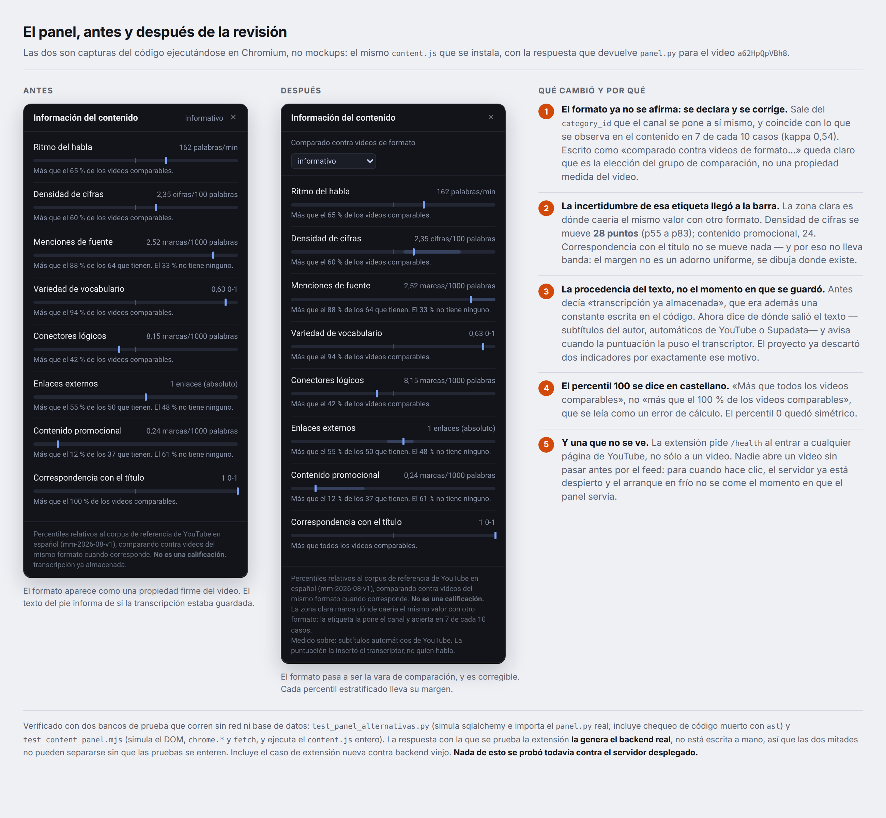

# Revisión de la Entrega 5 — respuesta al feedback

**Proyecto:** Información del contenido (antes «Nutri-Score de Contenidos»)
**Autor:** Juan Taraciuk
**Fecha:** agosto de 2026

> **Qué es este documento.** No sustituye a `05_diseno_frontal.md`, que queda tal como se
> entregó. Recoge el feedback recibido, deja constancia de qué se verificó, qué se decidió y
> qué se cambió en el software, para que la próxima entrega lo incorpore como cambio
> declarado en vez de reescribir hacia atrás. Es el mismo criterio de incrementalidad que se
> viene aplicando desde la Entrega 2.

---

## 1. El feedback, y qué se hizo con cada punto

| # | Observación | Veredicto | Qué se hizo |
|---|---|---|---|
| 1 | El nombre «Nutri-Score» sigue prometiendo un score que el producto ya no da | Correcta | **Producto renombrado** (§2) |
| 2 | «informativo» se muestra como una característica firme, y de ella dependen 5 de los 8 percentiles, pese a un kappa bajo | Correcta, y el problema es mayor de lo señalado | **Implementado**: formato corregible + margen visible (§3) |
| 3 | El selector aprender/entretenerse/decidir es una hipótesis de diseño, no algo validado | Correcta | **Se reemplaza la idea** (§4) |
| 4 | Si la utilidad está en decidir antes de ver, esperar minutos rompe el flujo | Correcta, es el punto de uso más serio | **Implementado en parte** (§5) |
| 5 | Se dice mostrar la procedencia de la transcripción, pero se informa de que ya estaba almacenada | Correcta, y era peor: el campo era una constante | **Implementado** (§6) |
| — | Simplificar el panel y hacer visibles las limitaciones | Correcta, y en tensión consigo misma | **Resuelto** (§7) |

---

## 2. Cambio de nombre, declarado

**«Nutri-Score de Contenidos» pasa a llamarse «Información del contenido».**

Nutri-Score es el nombre propio del sello A–E que la industria alimentaria pone en el frente
del envase. Es decir: el nombre del proyecto nombraba exactamente la pieza que el proyecto
eliminó tras la revisión de la Entrega 2. Lo que sobrevivió de la analogía no es el sello
sino **la tabla nutricional** — la que declara proteínas y calorías sin decirte si comer.

El nombre nuevo no se inventó: es el que la cabecera del panel viene mostrando desde que se
construyó. Se asciende lo que la interfaz ya decía.

**Alcance del cambio.** Se aplica al producto, a este documento y a los siguientes. Las
entregas 1 a 4 **no se retro-editan**: el nombre viejo queda ahí como parte del historial del
proyecto, igual que la letra A–E, y «Nutri-Score» sobrevive en la introducción como el origen
de la idea y como lo que el proyecto dejó de ser.

---

## 3. El formato: de etiqueta muda a vara declarada y corregible

### 3.1. Lo que se verificó

El informe `formato_verificado.md` se regeneró el 31/8. Las cifras vigentes son
**kappa de Cohen 0,54 y 30 % de desacuerdos (25 de 82)**, algo mejores que las citadas en el
feedback (0,49 y 33 %). La conclusión no cambia.

Pero hay tres cosas que el feedback no dice y que agravan el diagnóstico:

1. **El formato no describe el video: describe el canal.** Sale *únicamente* del
   `category_id` que el canal se autodeclara en YouTube. No mira título, duración, capítulos
   ni transcripción. Seis videos del corpus son «informativo» sólo porque el canal lo dice,
   sin ningún respaldo en el contenido.
2. **El error es asimétrico.** En la tabla cruzada, 10 videos que la regla marca
   `practico_personal` el modelo los lee como `informativo`. La regla sobre-asigna
   justamente la categoría más poblada.
3. **El propio informe ya prescribía el arreglo.** Su último párrafo dice que si kappa es
   bajo *«eso hay que decirlo al presentar cualquier resultado partido por formato»*. El
   frontal no lo cumplía. No hubo que pensar nada nuevo: hubo que aplicar una regla que el
   proyecto ya se había escrito.

### 3.2. Cuánto mueve la aguja

Calculado con la misma función `percentil()` del backend, sobre el video del mockup
(`a62HpQpVBh8`), para los 5 descriptores estratificados:

| Descriptor | informativo | práctico | entretenim. | deporte | margen |
|---|---:|---:|---:|---:|---:|
| Densidad de cifras | **60** | 65 | 83 | 55 | **28** |
| Contenido promocional | **12** | 31 | 36 | 19 | 24 |
| Enlaces externos | **55** | 56 | 60 | 47 | 13 |
| Menciones de fuente | **88** | 93 | 100 | 98 | 12 |
| Correspondencia con el título | **100** | 100 | 100 | 100 | **0** |

El valor medido no cambia nunca: 2,35 cifras por cada 100 palabras son 2,35 siempre. Lo que
cambia es contra quién se lo compara. **Veintiocho puntos percentiles de juego** en una
etiqueta que acierta 7 de cada 10 veces, presentados hasta ahora como «p60» a secas.

Y la frase de ausencia cambia de sentido entero: «el 33 % de los informativos tampoco tiene
fuentes» pasa a «el 62 % de los prácticos».

La última fila importa tanto como la primera: **correspondencia con el título no se mueve
nada**. Por eso esa fila no lleva banda. El margen no es un adorno que se pinta en todas
partes por prudencia: se dibuja donde existe, y su ausencia también informa.

### 3.3. Qué se implementó

- El formato dejó de ser una etiqueta muda en la cabecera. Ahora es una línea propia que
  dice **«Comparado contra videos de formato ⟨informativo ▾⟩»** y es un desplegable.
  El cambio de redacción no es cosmético: como etiqueta suelta, «informativo» se leía como
  una propiedad que el sistema afirmaba del video. Escrito así, queda claro que es **la
  elección del grupo de comparación**.
- Corregirlo **recalcula las 5 filas estratificadas sin pedir nada a la red**: el backend
  manda las cuatro lecturas de una vez.
- Cada fila estratificada lleva **una banda tenue** con el rango bajo formatos alternativos.
  Mismo tono que el marcador, sin color con significado.
- La corrección **se guarda sólo en ese navegador**. No pisa la etiqueta oficial del estudio
  y se dice en pantalla: *«Formato corregido por vos. Sólo en este navegador: no cambia la
  etiqueta del estudio.»*

**Por qué no se persiste la corrección.** Si la elección del usuario reescribiera
`content_features.formato`, el corpus de referencia y los videos medidos dejarían de estar
etiquetados con el mismo criterio — y que lo estén es lo único que hace comparable un
percentil. Guardarlas *como etiquetas humanas aparte*, en su propia tabla, sería en cambio
muy valioso: daría por fin etiquetas humanas contra las que medir kappa, en lugar de un
modelo evaluando a una regla. Queda como trabajo futuro con un motivo concreto.

### 3.4. Decisión técnica que conviene registrar

Las cuatro lecturas **se calculan al responder, no al guardar**. El valor crudo ya viaja en
la fila almacenada y la escala está en memoria, así que:

- los ~500 paneles ya calculados ganan la banda sin recalcular ni migrar nada;
- `content_features` no cambia de forma, y el dashboard —que lee esa tabla por posición y
  aborta si falta un descriptor— no se entera;
- no hace falta tocar `features_version`.

---

## 4. El selector de objetivo: la pregunta estaba bien, lo que hacía con la respuesta no

El feedback tiene razón y conviene ser preciso sobre en qué. La pregunta «¿para qué estás
mirando esto?» es buena: el usuario la contesta en dos segundos y es un hecho sobre él.
El problema es lo que el panel hacía después — decidir que *para aprender importan las
fuentes*. Eso es una opinión del diseñador sobre qué indicadores importan para qué objetivo.
Nadie la validó. Es el mismo pecado que la letra A–E, más chico y mejor disimulado.

De ahí sale el criterio que reemplaza al selector:

> **La entrada del usuario debe tocar la vara, no la lista.**

Reordenar los indicadores exige una hipótesis sobre cuáles importan. Elegir **contra quién
te comparás** no exige ninguna: toda referencia es tan legítima como otra, y elegirla es una
decisión del usuario, no un juicio del sistema.

Con ese criterio, las dos entradas del producto pasan a ser:

**A. Corregir el formato** — implementada, §3.

**B. Elegir el marco de comparación** — diseñada, no implementada:

> Comparar este video contra: ⟨todo YouTube · videos de este formato · **lo que yo suelo mirar**⟩

La tercera opción es la analogía nutricional tomada en serio. Una etiqueta de alimento tiene
dos columnas: los gramos, y el **porcentaje de tu valor diario** — cuánto pesa eso *en tu
dieta*, no en la dieta del promedio. El proyecto tiene las dos mitades hace meses y nunca las
juntó: el corpus de 344 videos y el historial propio viven en pantallas separadas.

Leído en el panel:

> Menciones de fuente — más que el 88 % del corpus, **y más que el 95 % de lo que vos mirás**.

No juzga nada, y de golpe es del usuario.

**Qué haría falta.** Un endpoint que devuelva las grillas de percentiles del historial propio
—los datos ya están en `content_features`— y la misma protección de piso de n del dashboard,
porque «lo que yo suelo mirar» sobre pocos videos es ruido con autoridad. Con el aviso de
dominancia también hace falta cuidado: con un canal llevándose el 54 % de los minutos, «lo
que vos solés mirar» quiere decir, en buena medida, ese canal.

**El riesgo que hay que redactar con cuidado.** Compararse contra uno mismo no dice si algo
es mejor: dice si es **distinto de la costumbre**. La copy tiene que decir exactamente eso y
nunca insinuar mejora, o la circularidad vuelve a entrar por una puerta nueva.

---

## 5. La latencia: dos regímenes, y la interfaz no los distinguía

El reproche es el más caro que se le puede hacer al producto, porque apunta a su promesa
central: si el valor está en decidir **antes**, una espera larga entrega la medida después
del momento en que servía.

Hay dos regímenes y el panel los mostraba igual:

- **Video ya analizado** — los ~500 enriquecidos y todo lo ya visto. Lectura de base, rápido.
- **Video nuevo con el servidor dormido** — arranque en frío de Render, más el
  enriquecimiento. El código espera hasta `ESPERA_MAXIMA_SEG = 240`.

**Lo que se implementó.** La extensión pide `/health` al entrar a **cualquier** página de
youtube.com, no sólo a un video, con un límite de una vez cada cinco minutos. Nadie abre un
video sin pasar antes por el feed: para cuando hace clic, el servidor lleva un rato
despierto. Es preferible a un cron externo por dos razones — no agrega una pieza más que
mantener corriendo, y calienta exactamente cuando alguien va a usar el producto en vez de
las veinticuatro horas del día.

**Lo que queda pendiente, y por qué.** Faltan dos cosas y una medición:

1. **Decir en qué régimen se está** antes de la espera («ya analizado» / «primera vez, puede
   tardar»). El backend ya expone en `/health` si el panel está precalentado, así que el dato
   existe.
2. **Prefetch al pasar el mouse** por las miniaturas del feed. Para los videos ya en base es
   una lectura gratis, y ahí la decisión ocurriría de verdad antes del clic. Para los que no
   están, no puede hacerse: gastaría un crédito de transcripción por cada miniatura.
3. **Medir.** No hay números cronometrados de cuánto tarda cada régimen: los que se citan
   salen de los comentarios del código, no de una corrida. Antes de prometer un tiempo en la
   próxima entrega hay que medirlo — `curl -w "%{time_total}"` contra `/health` y
   `/panel/{id}`, en frío y en caliente.

**Y una concesión honesta que conviene escribir.** Para un video genuinamente nuevo, el panel
no es una herramienta pre-decisión: es una herramienta *durante*. Decirlo vale más que
prometer lo contrario.

---

## 6. La procedencia de la transcripción

El feedback dice que la implementación informa de que el texto ya estaba almacenado en vez de
su fuente real. Es correcto, y al revisarlo apareció que era peor: en `panel.py`, el único
lugar donde se arma la respuesta, el campo estaba **escrito como constante**
(`"origen_transcripcion": "base"`). Nunca podía valer otra cosa, con lo cual la rama de
`content.js` que habría dicho «transcripción obtenida ahora» era **código inalcanzable**.

Mientras tanto el dato real existía y era sustantivo. En el historial:

| Fuente | Videos |
|---|---:|
| `youtube_auto` (subtítulos automáticos) | 47 |
| `youtube_manual` (subtítulos del autor) | 11 |
| `supadata` | 6 |
| sin transcripción | 32 |

Y ya venía seleccionado en la consulta del endpoint, junto con `transcript_is_generated`.

**Por qué no es cosmética.** El panel no mide el video: mide su transcripción. Este proyecto
ya descartó dos indicadores —`palabras_por_frase` y `preguntas_1000w`— al descubrir que la
puntuación la insertaba el transcriptor y no el hablante. Saber si el texto lo escribió una
persona o una máquina cambia de qué filas conviene fiarse.

**Qué se implementó.** El panel dice ahora *«Medido sobre: subtítulos automáticos de
YouTube. La puntuación la insertó el transcriptor, no quien habla.»* Cuando la fuente no está
registrada lo dice, en lugar de afirmar una que no conoce. `transcript_is_generated` admite
nulo y se respeta: «no se sabe» es preferible a inventarlo.

---

## 7. Simplificar y a la vez mostrar más

Las dos peticiones tiran en direcciones opuestas y se resolvieron así: **lo que se agrega es
visual y ocupa cero líneas de texto** (la banda), **lo que se agrega en texto reemplaza a
algo** (la procedencia sustituye a «transcripción ya almacenada»), y la explicación de la
banda es una sola línea al pie, con el detalle al pasar el mouse.

Queda pendiente la simplificación de fondo que se propuso y no se hizo: **colapsar por
defecto los descriptores que el usuario no está mirando**, para que el panel abra con menos
filas. Se dejó fuera porque el criterio para decidir cuáles colapsar era justamente el
selector de objetivo, que es lo que se retiró en §4. Con el marco de comparación como entrada,
habrá que pensarlo de nuevo.

**Un cambio menor incluido.** El percentil 100 decía «Más que el 100 % de los videos
comparables», que se lee como un error de cálculo. Ahora dice «Más que todos los videos
comparables», y el percentil 0 quedó simétrico («Menos que todos»).

---

## 8. El panel, antes y después

Las dos son capturas del código ejecutándose en Chromium, no mockups: el mismo `content.js`
que se instala en el navegador, con la respuesta que devuelve `panel.py` para el video
`a62HpQpVBh8`.

---

## 9. Cómo se verificó, y qué no está verificado

Dos bancos de prueba que corren sin red y sin base de datos:

- **`test_panel_alternativas.py`** — simula sqlalchemy y el motor de base de datos, e importa
  el `panel.py` real. Comprueba que la extracción de `leer_contra()` no cambió ni uno de los
  ocho percentiles, que la lectura del formato propio coincide con la oficial, los casos
  borde (sin valores, rasgo ausente, formato desconocido), y que `ubicar()` sigue devolviendo
  filas sin el campo nuevo, de modo que lo guardado no cambia de forma. Incluye un chequeo de
  **código muerto con `ast`**, porque esta edición movió bloques dentro de funciones y ése es
  el síntoma que `py_compile` no ve.
- **`test_content_panel.mjs`** — simula el DOM, `chrome.*` y `fetch`, y ejecuta el
  `content.js` entero, arranque incluido. **La respuesta con la que se prueba la extensión la
  genera el backend real**, no está escrita a mano: las dos mitades no pueden separarse sin
  que la prueba se entere. Incluye el escenario de despliegue desparejo —extensión nueva
  contra backend viejo— donde el panel tiene que seguir sirviendo sin inventar una banda ni
  un desplegable vacío.

**Lo que no está verificado, y hay que decirlo:** nada de esto se probó contra el servidor
desplegado ni contra la base real. Falta desplegar el backend, recargar la extensión y abrir
un video de cada tipo — uno ya enriquecido, uno nuevo, uno sin subtítulos.

---

## 10. Qué queda abierto

| Pendiente | Origen |
|---|---|
| Elegir el marco de comparación, incluido el historial propio | §4 |
| Decir en qué régimen de latencia se está, y medirlo | §5 |
| Prefetch en las miniaturas del feed | §5 |
| Colapsar por defecto parte del panel | §7 |
| Persistir las correcciones de formato como etiquetas humanas, para medir kappa contra la regla | §3.3 |
| Unidades que se leen mal en el panel: «1 enlaces (absoluto)», «0,63 0-1» | detectado al capturar |
